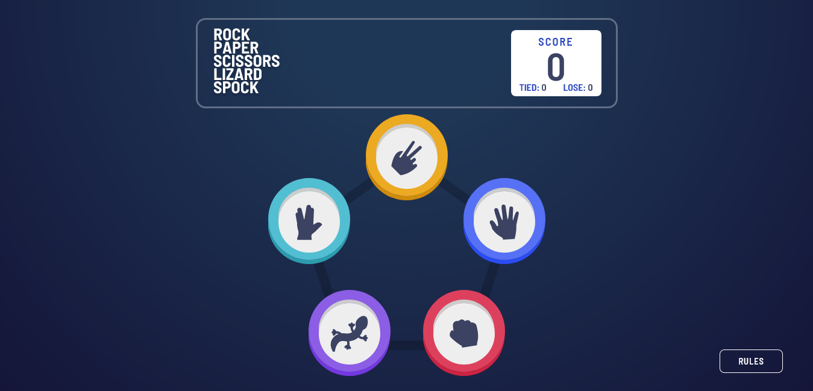
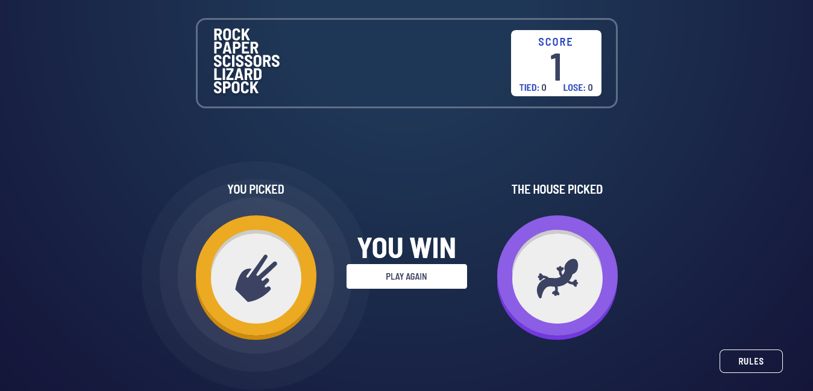
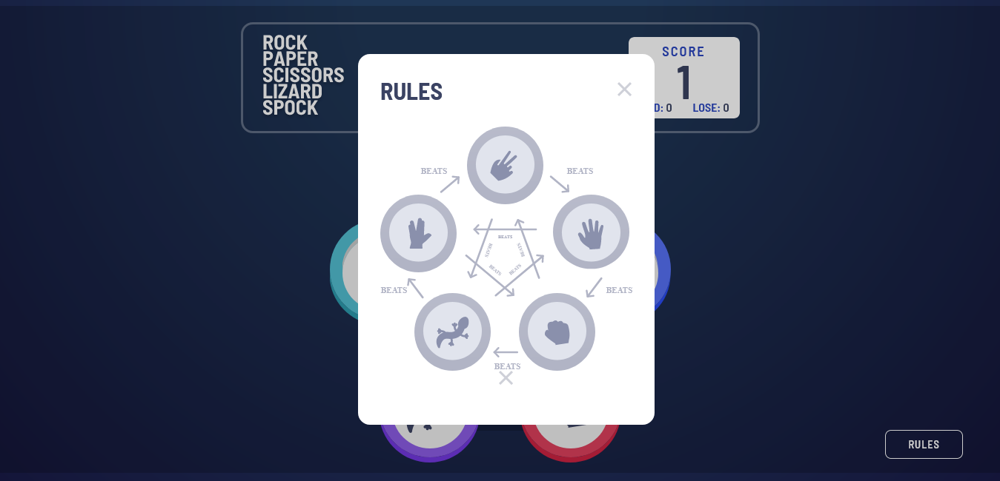
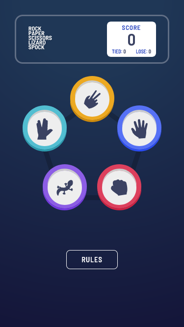
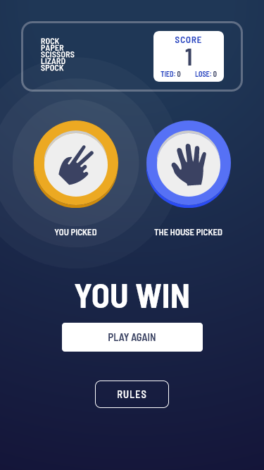
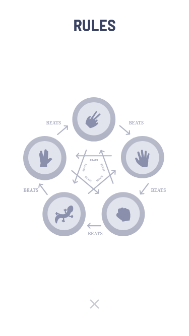

# Frontend Mentor - Rock, Paper, Scissors solution (Bônus)

Esta é uma solução para o desafio [Rock, Paper, Scissors (Bônus) challenge on Frontend Mentor](https://www.frontendmentor.io/challenges/rock-paper-scissors-game-pTgwgvgH) Os desafios do Frontend Mentor ajudam você a melhorar suas habilidades de codificação ao construir projetos realistas.

- Original:
  - [Frontend Mentor -  Rock, Paper, Scissors](https://github.com/JulioAlves-Dev/rock-paper-scissors-challenge-on-frontend-mentor)

## Índice

- [Visão geral](#visão-geral)
  - [O desafio](#o-desafio)
  - [Screenshot](#screenshot)
  - [Links](#links)
- [Processo](#processo)
  - [Construído com](#construído-com)
- [Autor](#autor)

## Visão geral

### O desafio

Os usuários devem ser capazes de:

- Veja o layout ideal para o jogo, dependendo do tamanho da tela do dispositivo
- Jogue pedra, papel e tesoura contra o computador
- Manter o estado da pontuação após atualizar o navegador _(opcional)_
- **Bônus**: Jogue Pedra, Papel, Tesoura, Lagarto, Spock contra o computador _(opcional)_

### Screenshot

### Links

- URL do site ao vivo: [Link](https://julioalves-dev.github.io/rock-paper-scissors-lizard-spock-bonus/)

## Processo

### Construído com

- HTML5
- CSS3
- JavaScript

## Autor

- Frontend Mentor - [@JulioAlves-Dev](https://www.frontendmentor.io/profile/JulioAlves-Dev)
- Twitter - [@JulioAlv35](https://twitter.com/JulioAlv35)
- Linkedin - [Julio Alves](https://www.linkedin.com/in/julio-alves-0119b01a6/)
